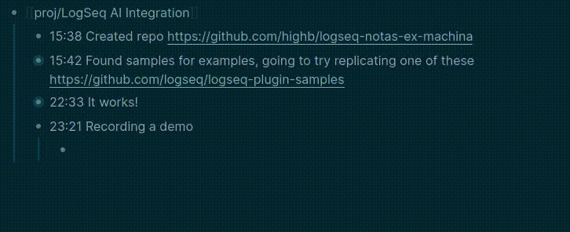

# logseq-notas-ex-machina
LogSeq Plugin that provides fun integrations with various machine models for your notes

### Demo

### API

##### Logseq.Editor

- `registerSlashCommand: (this: LSPluginUser, tag: string, actions: Array<SlashCommandAction>) => boolean`
- `showMsg: (content: string, status?: 'success' | 'warning' | string) => void`
    - content support  [hiccups](https://github.com/weavejester/hiccup) string

### Running the Sample

- `Load unpacked plugin` in Logseq Desktop client.
